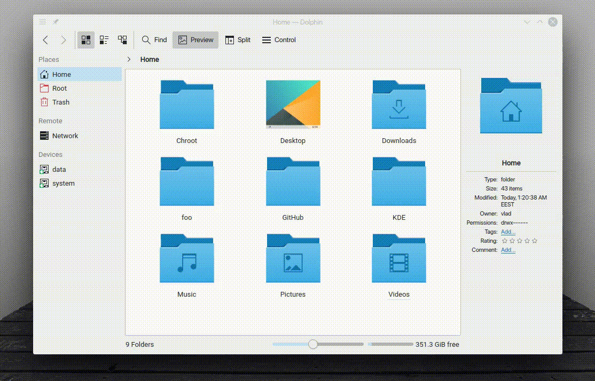

"Disappear 2" is a KWin effect that animates the disappearing of windows.
Also, this effect is known as Glide 2 (from Compiz).

## Installing

### From source

```sh
git clone https://github.com/zzag/kwin-effects-disappear2.git
cd kwin-effects-disappear2
mkdir build && cd build
cmake ..
make -jN
sudo make install
```
